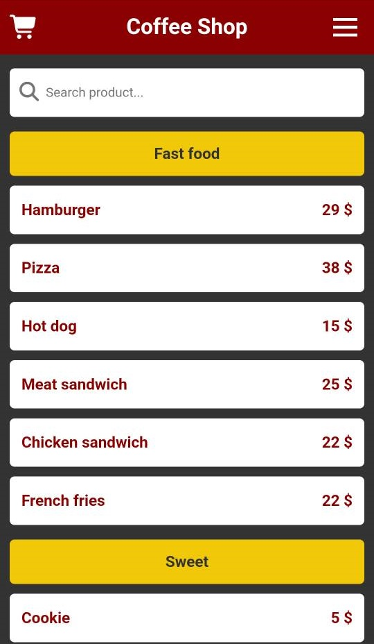
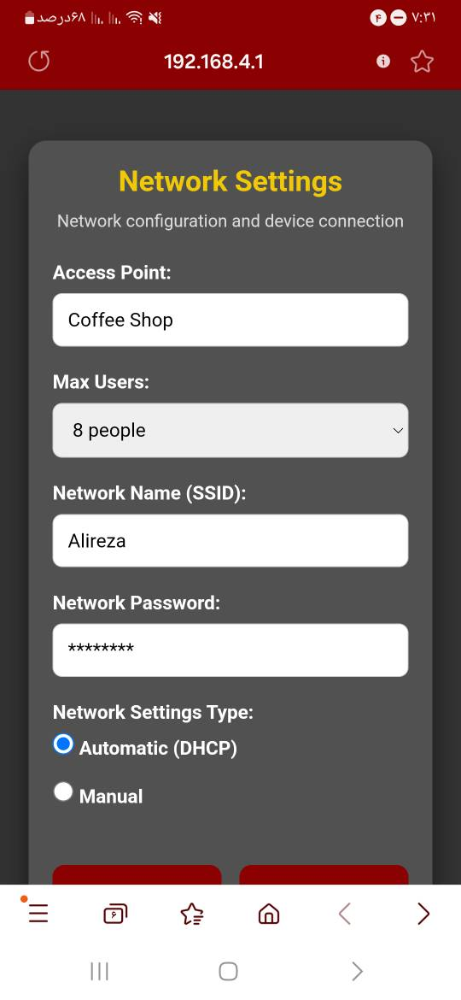

# 🍽️ Menufy – ESP32 Restaurant Middleware

**Turn your ESP32 module into a lightweight web server for price viewing and customer order management**

---

## 📸 System Preview

  <table>
    <tr>
      <td align="center"></td>
      <td align="center"></td>
    </tr>
  </table>

---

## 🧠 Overview

**Menufy** is a middleware that converts your ESP32 module into a restaurant web server for viewing prices and registering customer orders.

This middleware supports three languages: Persian, Arabic, and English. It has the ability to define two users (admin user and regular user). You can add or remove categories, add products to the menu, and edit existing products.

To access the management section, go to the login page and enter the default username and password.

---

## ✨ Key Features

| Feature | Description |
|---------|-------------|
| 🌐 Web Server | Built-in ESP32 web server |
| 🔤 3 Languages | Persian (فارسی), Arabic (العربية), English |
| 👥 2 User Roles | Admin + Regular user |
| 📋 Menu Management | Add/remove categories, add/edit/delete products |
| 🔐 Secure Admin | Password-protected login |
| 📱 Mobile Ready | Works on all devices |
| 💾 On-board Storage | No external database needed |

---

## 🔧 Hardware Requirements

| Component | Description |
|-----------|-------------|
| ESP32 | Any ESP32 development board |
| Power Supply | 5V USB or DC adapter |
| USB Cable | For programming |

---

## ⚙️ Installation

### Step 1: Clone the repository
\`\`\`bash
git clone https://github.com/alireza-moshfeghi/Menufy_ESP32.git
\`\`\`

### Step 2: Open in Arduino IDE
- Install ESP32 board package if not already installed
- Select your ESP32 board from Tools > Board menu

### Step 3: Upload the code
- Connect your ESP32 via USB
- Select the correct port
- Click Upload button

### Step 4: Power up
- After upload completes, the ESP32 creates its own Wi-Fi network

---

## 🚀 Usage Guide

### Connect to the Access Point

| Setting | Value |
|---------|-------|
| SSID | \`Menufy_Restaurant\` |
| Password | (none - open network) |

### Access the Web Interface

Open your browser and navigate to:

👉 **http://192.168.4.1**

### Admin Login

To access the management section:

👉 **http://192.168.4.1/login/**

| Field | Default Value |
|-------|---------------|
| Username | \`admin\` |
| Password | \`admin\` |

> ⚠️ Important: Change the default password after your first login!

### Admin Capabilities

After logging in as admin, you can:

| Action | Description |
|--------|-------------|
| ➕ Add Category | Create new menu categories |
| ➕ Add Product | Add products to any category |
| ✏️ Edit Product | Modify product name, price, or description |
| 🗑️ Delete | Remove categories or products |
| 🌐 Change Language | Switch between Persian, Arabic, English |
| ⚙️ Settings | Configure module settings |

---

## 🌍 Language Support

| Language | Direction | Status |
|----------|-----------|--------|
| Persian (فارسی) | RTL | ✅ Full support |
| Arabic (العربية) | RTL | ✅ Full support |
| English | LTR | ✅ Full support |

---

## 🔐 Default Login Credentials

| Role | Username | Password |
|------|----------|----------|
| Admin | \`admin\` | \`admin\` |
| Regular User | (not required) | (no login needed for viewing menu) |

**Security Note:** Change the default admin password immediately after first login. Go to Settings > Change Password.

---

### Add More Languages

The language system is extensible. Add new language JSON files in the \`data/\` folder.

---

## ⚠️ Disclaimer

This project is intended for testing, research, and educational purposes only. It is not licensed for commercial use. Performance and reliability in production environments are not guaranteed.

---

## 📄 License

This project is licensed under the MIT License. You are free to use, modify, and distribute this software with proper credit to the author.

---

## 🤝 Contributing

Contributions are welcome! Please:
1. Fork the repository
2. Create a feature branch
3. Submit a pull request

---

## 📧 Contact

For questions or support, please open an issue on GitHub.

---

**Built with ❤️ using ESP32 — Smart middleware for modern restaurants**

